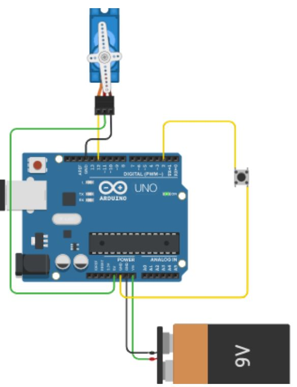
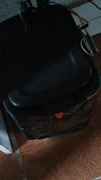

# Controlador para Tampa de Lixeira com botão

Projeto para resolução de um problema particular... uma lixeira com uma tampa 'peculiarmente difícil' de abrir.

O botão (conectado ao pino **D2** presente no projeto faz as duas funções de Abrir e Fechar a Lixeira dependendo do estado atual da mesma.

O circuito conta com o **Sleep Mode** do Arduíno.

O Consumo em standby gira em torno dos 5mA. (ver detalhes sobre o consumo no projeto [Controlador de Torneira](https://github.com/hvilela0/ControladorDeTorneira#demonstra%C3%A7%C3%A3o-da-economia-de-energia-com-o-modo-sleep))

Código pode ser praticamente todo configurado através dos **#define**s no início do código.

## Hardware:

- 1 Arduino Nano
- 1 botão push button
- 1 servo motor Micro SG90

## Pinout (Arduino):
- Servo motor: D12
- Botão: D2

## Circuito
 *Obs: o circuito original é feito com o Arduino NANO, mas a pinagem é a mesma.*

## Demonstração do funcionamento final

